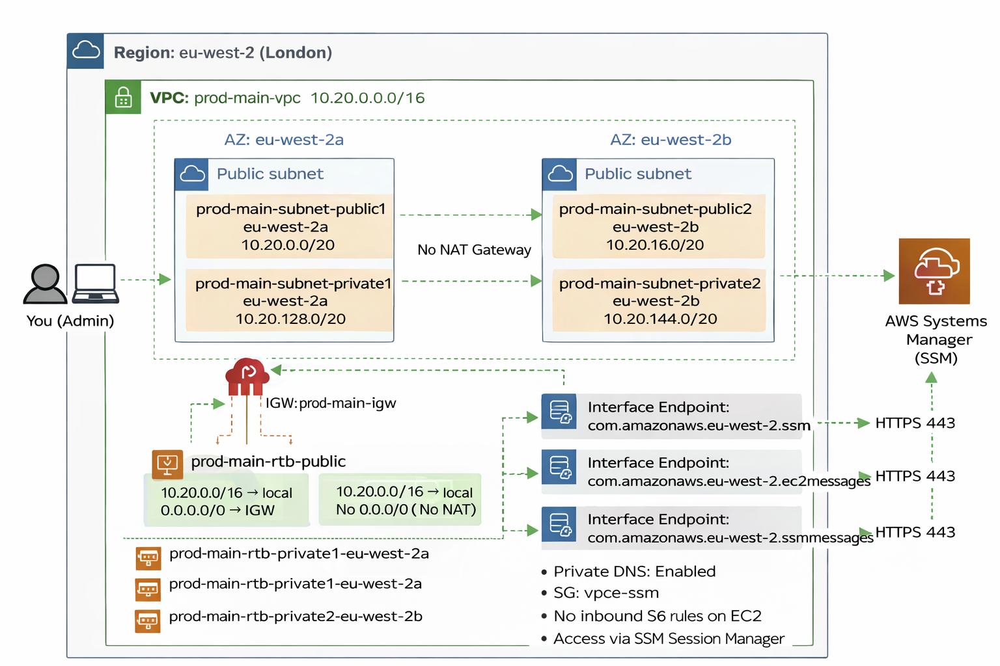

# Private EC2 via SSM (No NAT, No Bastion)

## What this project does
- Creates a VPC with public + private subnets (eu-west-2)
- Launches an EC2 instance in a private subnet (no public IP)
- Accesses the instance using AWS Systems Manager Session Manager
- No bastion host and no inbound security group rules
- No NAT Gateway (uses VPC Interface Endpoints for SSM)

## Architecture Diagram

## Architecture (high level)
- VPC: 10.20.0.0/16 (prod-main-vpc)
- Public subnets: 10.20.0.0/20 (2a), 10.20.16.0/20 (2b)
- Private subnets: 10.20.128.0/20 (2a), 10.20.144.0/20 (2b)
- Interface Endpoints: ssm, ec2messages, ssmmessages
- Private EC2 SG: inbound none, outbound allowed
- Endpoint SG: inbound 443 from private EC2 SG

## How to connect
- Systems Manager → Session Manager → Start session
- Or CLI:
  aws ssm start-session --target <instance-id> --region eu-west-2

## Notes / Troubleshooting
- If Session Manager fails with CloudWatch Logs encryption errors:
  Systems Manager → Session Manager → Preferences → disable CloudWatch logging
  (Session Manager does not require CloudWatch logging.)

## Cleanup
See docs/teardown.md
